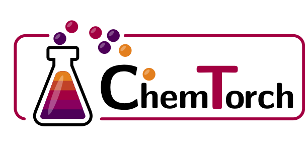

# Reproducing Results with Additional 3D Information

This guide explains how to reproduce results using extra 3D information with ChemTorch. **Step 1** covers installing all the necessary dependencies. **Steps 2** and **3** are optional, as the files they produce are already available in the `data` folder.


> **⚠️ Attention:**  
> In this repository, the data is available to produce all results except the ones for `rgd1`. The data files for `rgd1` are too big for GitHub and can be found on [zenodo](https://zenodo.org/records/15488056)


## 1. Install ChemTorch

First, install the necessary dependencies: 


```bash
conda create -n chemtorch python=3.10 && \
conda activate chemtorch && \
pip install rdkit numpy==1.26.4 scikit-learn pandas && \
pip install torch==2.5.1 && \
pip install hydra-core && \
pip install torch_geometric && \
pip install torch_scatter torch_sparse torch_cluster torch_spline_conv -f https://data.pyg.org/whl/torch-2.5.0+cpu.html && \
pip install wandb && \
pip install lightning && \
pip install ipykernel && \
```

For GPU usage:
```bash
pip install torch-scatter torch-sparse -f [https://data.pyg.org/whl/torch-$](https://data.pyg.org/whl/torch-$){TORCH}+${CUDA}.html
```

Then you need to install [ChemTorch](https://github.com/heid-lab/chemtorch) using this fork. First, clone it with
```bash
git clone https://github.com/JohannesKarwou/chemtorch.git
``` 
and then do `pip install -e .`

> **📝 Note:**  
> Replace TORCH with your PyTorch version (e.g., 2.6.0) and CUDA with your CUDA version (cpu, cu118, or cu121).

## 2. Creating Diffusion and/or Flow Matching Coordinates [Optional]

To create diffusion or flow matching coordinates, follow the instructions from the GoFlow repository ([GoFlow](https://github.com/heid-lab/goflow))

You can use the following `.sh` file, which is a slight modification of the original GoFlow file:

```bash
uv run flow_train.py -m \
    model.num_steps=25 \
    model.num_samples=25 \
    task_name=rdb7_cutoff \
    seed=0,1,2,3,4,5 \
    data=rdb7 \
    model.representation.cutoff_fn.cutoff=5.0 \
    model.representation.cutoff_fn.scaling=0.75
```
**Important**: Ensure you use the train/val/test CSV files located in data/rdb7.

## 3. Creating Descriptors from Coordinates [Optional]

> **📝 Note:**  
> You need to install `pip install mace-torch` and `pip install ase` to use the following notebook


If you wish to create the descriptors yourself:

  1.  Use the provided train/val/test CSV files and their corresponding XYZ files found in `data/rdb7`.

   2.  Run the `create_coord_descriptor.ipynb` notebook.

This process will generate the following files:
`train_mace_mp_ts.npz`
`val_mace_mp_ts.npz`
`test_mace_mp_ts.npz`

These files are essential for model training (train/val) and ground truth prediction (test).

To generate descriptors from diffusion or flow matching geometries, execute the last two cells of the notebook. This will create:

`coordinates_flowMatching.pkl`
`coordinates_diffusion.pkl`

## 4. Training a Model using Additional 3D Features

Before training, verify that you have the following files in your `data/rdb7` directory:

* `train`/`val`/`test` CSV files
* `train_mace_mp_ts.npz` and `val_mace_mp_ts.npz` (for model training)
* `test_mace_mp_ts.npz`, `test_mace_mp_ts_diffusion.npz`, or `test_mace_mp_ts_flow_matching.npz` (depending on which coordinates you want to choose for the prediction)

To train a model with the hyperparameters used to produce Table IV, run the following script:

```bash
bash rdb7.sh
```

This script will run four grouped multi-run experiments (using `Hydra`) on the RDB7 dataset—first with ground-truth 3D coordinates, then with diffusion and flow-matching coordinates, and finally without any coordinates—logging each run to its own `.log` file. For each run it sweeps over three random seeds and, for each experiment, iterates through three data splits (random, reaction-core, and barrier), applying the specified learning rates and model hyperparameters. For RGD1 there exists exaclty the same script called `rgd1.sh`, note this takes much longer and you need to get the RGD1 data from zenodo as mentioned in the beginning of this README


-------------------------------

<div align="center">



[Installation](#installation) | [Data](#data) | [Usage](#usage) | [Citation](#citation)

</div>

## Introduction

ChemTorch is a modular framework for developing and benchmarking deep learning models on chemical reaction data. The framework supports multiple families of reaction representations, neural network architectures, and downstream tasks.

The code is provided under MIT license, making it freely available for both academic and commercial use.

## Installation

### Via conda

```
conda create -n chemtorch python=3.10 && \
conda activate chemtorch && \
pip install rdkit numpy==1.26.4 scikit-learn pandas && \
pip install torch==2.5.1 && \
pip install hydra-core && \
pip install torch_geometric && \
pip install torch_scatter torch_sparse torch_cluster torch_spline_conv -f https://data.pyg.org/whl/torch-2.5.0+cpu.html && \
pip install wandb && \
pip install ipykernel && \
pip install -e .
```

For GPU usage
```
pip install torch-scatter torch-sparse -f https://data.pyg.org/whl/torch-${TORCH}+${CUDA}.html
```

### Via uv

For installing with uv, first install uv, for example via
```
pip install uv
```

Then run
```
uv sync -n
uv add torch_scatter torch_sparse torch_cluster torch_spline_conv torch_geometric  --no-build-isolation -n
```

## Data

Get the data from https://github.com/heid-lab/reaction_database and add it to the `data` folder.

## Usage

For a short demo, see `scripts/demo.ipynb`.

To run the experiments, you can use the following commands:

Graph-based: GNN + CGR
```
python scripts/main.py +experiment=graph dataset.subsample=0.05
```
Token-based: HAN + Tokenized SMILES
```
python scripts/main.py +experiment=token dataset.subsample=0.05
```
Fingerprint-based: MLP + DRFP
```
python scripts/main.py +experiment=fingerprint dataset.subsample=0.001
```
3D-based: DimeNetplusplus + XYZ coordinates
```
python scripts/main.py +experiment=xyz dataset.subsample=0.05
```

Using the terminal, you can easily change hyperparameters. For example, to change the dataset:
``` 
python scripts/main.py +experiment=graph dataset.subsample=0.05 data_ingestor=sn2
```

For simple sweeps, you can:
```
python scripts/main.py --multirun +experiment=graph dataset.subsample=0.05 data_ingestor=sn2,e2,cycloadd
```

## Citation
If you use this code in your research, please cite the following paper:

```
@article{}
```

This framework was inspired by:
- [GraphGPS](https://github.com/rampasek/GraphGPS/tree/main)
- [GraphGym](https://github.com/snap-stanford/GraphGym)
- [lightning-hydra-template](https://github.com/ashleve/lightning-hydra-template)
